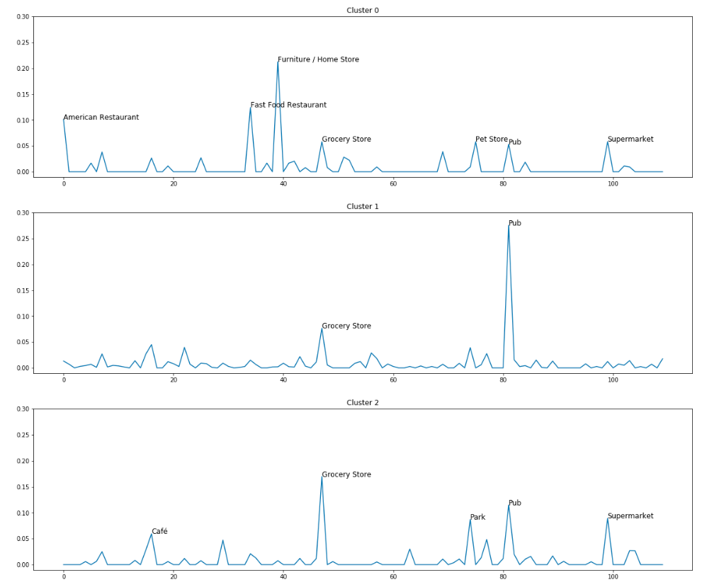

# Coursera_Capstone
Unsupervised learning model for clustering neighborhoods based on common venues & business types

## Sample screenshots

**Mapping of Norwich neighborhoods into clusters (coded by color)**

**Snapshot of commonly seen venues & business types in the first three clusters**

